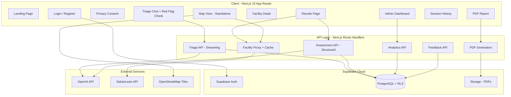
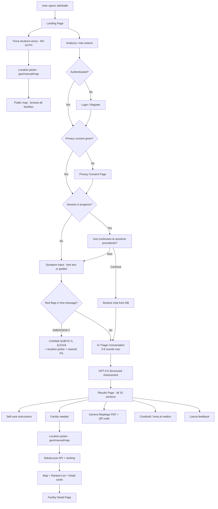
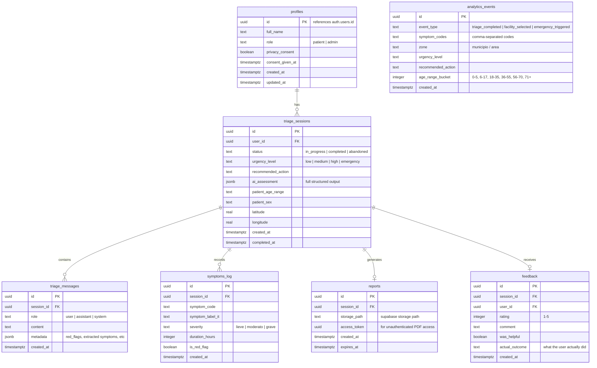
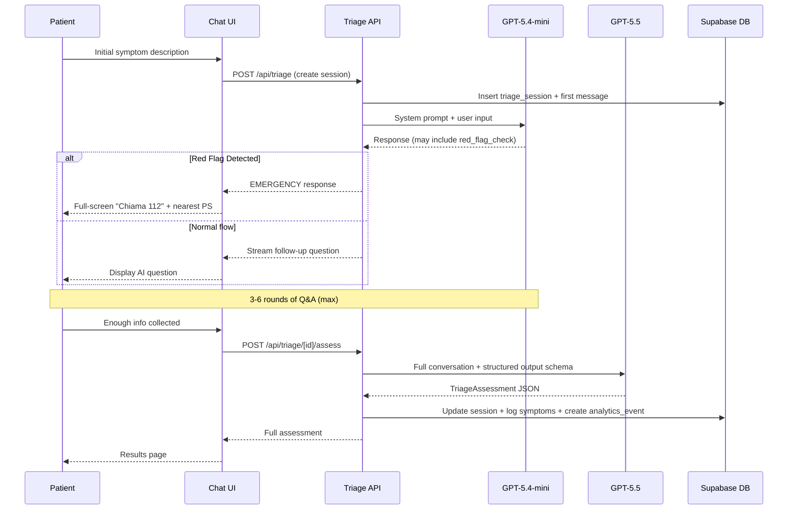
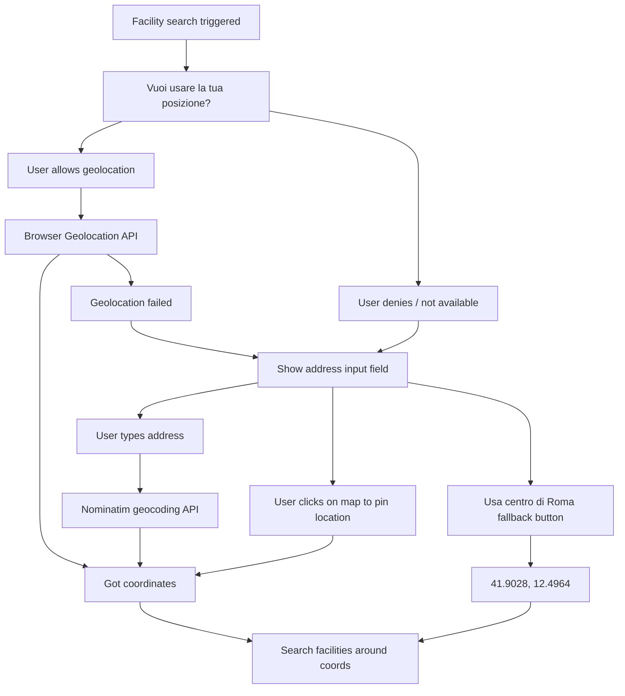

# JetHealth - AI Triage & Care Navigation System for Rome

## Architecture Overview



---

## Tech Stack

- **Framework**: Next.js 15 (App Router, RSC, Server Actions)
- **Language**: TypeScript (strict)
- **UI**: Shadcn UI + Tailwind CSS v4
- **Auth**: Supabase Auth (email+password, server-side sessions via `@supabase/ssr`)
- **Database**: Supabase PostgreSQL (with Row Level Security)
- **Storage**: Supabase Storage (PDF reports bucket)
- **AI**: OpenAI API
  - `gpt-5.4-mini` for conversational triage (streaming, low latency)
  - `gpt-5.5` for final structured assessment (high accuracy)
- **Maps**: Leaflet.js + React-Leaflet + OpenStreetMap tiles
- **PDF**: `@react-pdf/renderer` (server-side generation)
- **Validation**: Zod (forms + AI structured output)
- **State**: Zustand (client chat state only)
- **Deployment**: Docker (Next.js app only; Supabase is cloud)

---

## User Flow (Complete)



---

## Database Schema (Supabase PostgreSQL)



**Key design decisions:**
- `analytics_events` is deliberately DISCONNECTED from users (no FK to profiles) for anonymization
- `ai_assessment` stored as JSONB for full audit trail
- `reports.access_token` allows sharing PDF without login
- RLS ensures patients see only their own sessions; admins see all

---

## AI Triage System

### Flow Detail



### Urgency Levels (4 levels, matching prompt.md)

- **Bassa (low)**: Symptoms stable, no red flags. Suggest: self-care, monitor, GP next day, pharmacy
- **Media (medium)**: Needs medical attention within hours/day. Suggest: GP, Guardia Medica (116117), pharmacy, ambulatorio
- **Alta (high)**: Potentially serious. Suggest: go to PS soon, show ranked PS list + map
- **Emergenza (emergency)**: Critical. IMMEDIATELY show "Chiama 112/118" + nearest PS. No delay.

### Routing Table

- `low` -> Self-care page (no facility search)
- `low` + pharmacy needed -> Farmacie (003)
- `medium` -> Studio Medico (009) + Guardia Medica 116117 + Visite ed esami (008)
- `high` -> Pronto Soccorso (006) ranked by relevance
- `emergency` -> Immediate 112 + nearest Pronto Soccorso (006)

### AI Structured Output Schema (Complete)

```typescript
const TriageAssessment = z.object({
  urgencyLevel: z.enum(["low", "medium", "high", "emergency"]),
  recommendedAction: z.enum([
    "self_care",
    "pharmacy",
    "general_practitioner",
    "guardia_medica",
    "outpatient_clinic",
    "emergency_department",
    "call_112",
  ]),
  plainLanguageExplanation: z.string(),
  primaryConcern: z.string(),
  symptoms: z.array(z.object({
    code: z.string(),
    labelIt: z.string(),
    severity: z.enum(["lieve", "moderato", "grave"]),
    durationHours: z.number().optional(),
    isRedFlag: z.boolean(),
  })),
  redFlagsDetected: z.array(z.string()),
  nextSteps: z.array(z.string()),
  watchFor: z.array(z.string()),
  selfCareInstructions: z.array(z.string()).optional(),
  facilitySearchRequired: z.boolean(),
  preferredFacilityTypes: z.array(z.string()),
  specialtyNeeds: z.array(z.enum([
    "pediatria",
    "cardiologia",
    "neurologia",
    "traumatologia",
    "ostetricia_ginecologia",
    "generale",
  ])),
  confidence: z.enum(["low", "medium", "high"]),
  safetyDisclaimer: z.string(),
})
```

### AI Safety Guardrails (System Prompt Rules)

1. NEVER provide definitive diagnoses ("Hai X" is forbidden)
2. ALWAYS use cautious language: "I sintomi sembrano compatibili con...", "Potrebbe essere opportuno..."
3. Conservative bias: when in doubt, escalate to higher urgency level
4. Include disclaimers in EVERY response
5. For ANY chest pain, breathing difficulty, loss of consciousness, stroke signs -> IMMEDIATE emergency
6. NEVER recommend stopping prescribed medications
7. NEVER suggest specific drugs (only "consulta il farmacista")
8. NEVER say "non hai nulla" or "non andare dal medico"
9. Always end with: "Se i sintomi peggiorano rapidamente, chiama subito il 112/118"
10. Max 6 rounds of questions, then assess with available info

### Tone of Voice (Italian)

Embedded in system prompt - examples:
- Low: "Dai sintomi indicati non emergono segnali di emergenza immediata. Al momento potrebbe non essere necessario andare in pronto soccorso. Ti consigliamo di monitorare i sintomi e contattare il medico di base o la continuita assistenziale se persistono o peggiorano."
- High: "I sintomi che hai indicato possono richiedere assistenza urgente. Ti consigliamo di chiamare subito il 112/118 o recarti al pronto soccorso."
- Emergency: "Potrebbe trattarsi di un'emergenza. Chiama subito il 112/118. Non guidare da solo se hai sintomi gravi."

---

## SaluteLazio API Integration

### API Details

**Base URL**: `https://server.salutelazio.it/server/external-services/facilities/structures`

**Headers required**:
```
accept: application/json
authorization: Bearer
origin: https://salutelazio.it
referer: https://salutelazio.it/
```

**Endpoints**:
- `GET /list?westLng=&southLat=&eastLng=&northLat=&zoom=&lang=it&page=&limit=&originLat=&originLng=&facilityTypeIds=` - Geo-bounded facility search
- `GET /:url-slug?lang=it` - Single facility detail (includes serviceLabels, contactEmail, address breakdown)

**Facility Type Codes**:
- `001` = ASL (Local Health Authority)
- `002` = Consultori (Family clinics)
- `003` = Farmacie (Pharmacies) - 267 in Rome
- `006` = Pronto Soccorso (ER) - 24 in Rome
- `007` = Strutture per ricovero (Hospitals)
- `008` = Visite ed esami (Outpatient) - 316 in Rome
- `009` = Studio Medico (GP offices) - 3286 in Rome

**Response shape per facility**:
```typescript
interface SaluteLazioFacility {
  url: string;           // slug for detail endpoint
  name: string;
  plainAddress: string;
  contactPhone: string;
  types: Array<{
    area: { code: string; labels: { it: string }; color: string };
    code: string;
    labels: { it: string };
  }>;
  emergencyOrganizationId: string | null;
  geometry: { longitude: number; latitude: number };
  distanceKm: number;   // from originLat/originLng
}
```

**Detail response adds**: `serviceLabels` (array of service codes), `contactEmail`, `address` (structured), `openingHours`

### PS Ranking Logic

Since the API does NOT expose waiting times or patient counts publicly, ranking is based on:
1. **Distance** (from patient geolocation) - weight: 40%
2. **Specialty match** (from `serviceLabels` in detail) - weight: 40%
3. **Phone availability** (contactPhone not empty) - weight: 10%
4. **Data completeness** - weight: 10%

Specialty matching logic:
- Neurological symptoms -> prioritize facilities with neurology service labels
- Cardiac symptoms -> prioritize cardiology/emodinamica
- Pediatric patient -> prioritize "Bambino Gesu" and pediatric PS
- Pregnancy -> prioritize obstetrics/gynecology
- Trauma -> prioritize trauma center labels

**KNOWN LIMITATION**: No real-time waiting time data available from the public API. The UI will show "Dati attesa non disponibili" and link to `salutelazio.it` for live data.

### Guardia Medica (Continuita Assistenziale)

Not available via API. Static data:
- **Roma e Provincia**: 116117 (Numero Unico Europeo)
- **Active H24** for information
- **Care visits**: nights 20:00-08:00, Sat/pre-holidays 10:00-20:00, Sun/holidays 08:00-20:00
- **Other provinces**: Frosinone 800185486, Latina 0773520888, Rieti 800199910
- **Emergency always**: 112

### Caching Strategy

SaluteLazio API data (facility lists) cached server-side:
- Facility list responses: cache for 1 hour (facilities don't move)
- Facility detail responses: cache for 6 hours
- Implementation: Next.js `unstable_cache` or in-memory Map with TTL
- Cache invalidated on app restart

---

## Project Structure

```
jethealth/
├── Dockerfile
├── docker-compose.yml
├── package.json
├── next.config.ts
├── tailwind.config.ts
├── tsconfig.json
├── .env.example
├── .env.local                          # gitignored
├── Docs/
│   └── self-doc.md
├── supabase/
│   └── migrations/                     # SQL migration files
│       ├── 001_create_profiles.sql
│       ├── 002_create_triage_tables.sql
│       ├── 003_create_analytics.sql
│       └── 004_create_rls_policies.sql
├── src/
│   ├── app/
│   │   ├── layout.tsx                  # Root layout (Supabase provider)
│   │   ├── page.tsx                    # Landing page
│   │   ├── (public)/                   # NO auth required
│   │   │   ├── facilities/
│   │   │   │   ├── page.tsx            # Public map browser
│   │   │   │   └── [slug]/page.tsx     # Public facility detail
│   │   │   └── report/
│   │   │       └── download/[token]/page.tsx # Public report viewer
│   │   ├── (auth)/
│   │   │   ├── login/page.tsx
│   │   │   ├── register/page.tsx
│   │   │   ├── consent/page.tsx        # Privacy consent
│   │   │   └── layout.tsx
│   │   ├── (app)/
│   │   │   ├── layout.tsx              # Auth-protected layout
│   │   │   ├── triage/
│   │   │   │   ├── page.tsx            # Start new triage (+ resume check)
│   │   │   │   └── [id]/
│   │   │   │       ├── page.tsx        # Chat interface
│   │   │   │       └── results/page.tsx # Full results + location picker
│   │   │   ├── history/page.tsx        # Past sessions
│   │   │   ├── report/[id]/page.tsx    # View/download own report
│   │   │   └── settings/page.tsx       # Profile + data deletion
│   │   ├── admin/
│   │   │   ├── layout.tsx              # Admin-only guard
│   │   │   ├── page.tsx                # Dashboard overview
│   │   │   ├── users/page.tsx
│   │   │   ├── sessions/page.tsx
│   │   │   └── analytics/page.tsx      # Outbreak detection
│   │   └── api/
│   │       ├── triage/
│   │       │   ├── route.ts            # POST: create session
│   │       │   └── [id]/
│   │       │       ├── message/route.ts # POST: stream chat
│   │       │       └── assess/route.ts  # POST: final assessment
│   │       ├── facilities/
│   │       │   ├── search/route.ts     # GET: proxy + cache
│   │       │   └── [slug]/route.ts     # GET: detail proxy
│   │       ├── report/
│   │       │   ├── [id]/route.ts       # GET: generate PDF
│   │       │   └── download/[token]/route.ts # Public PDF access
│   │       ├── feedback/route.ts       # POST: user feedback
│   │       └── admin/
│   │           ├── analytics/route.ts
│   │           ├── users/route.ts
│   │           └── export/route.ts     # GET: CSV export
│   ├── components/
│   │   ├── ui/                         # Shadcn components
│   │   ├── chat/
│   │   │   ├── chat-interface.tsx
│   │   │   ├── message-bubble.tsx
│   │   │   ├── typing-indicator.tsx
│   │   │   └── emergency-interrupt.tsx # Red flag full-screen alert
│   │   ├── map/
│   │   │   ├── facility-map.tsx
│   │   │   ├── facility-marker.tsx
│   │   │   ├── location-picker.tsx     # Geo + manual address + map click
│   │   │   └── radius-selector.tsx
│   │   ├── triage/
│   │   │   ├── severity-badge.tsx
│   │   │   ├── recommendation-card.tsx
│   │   │   ├── next-steps-list.tsx
│   │   │   ├── watch-for-list.tsx
│   │   │   └── call-emergency-banner.tsx
│   │   ├── facilities/
│   │   │   ├── facility-card.tsx
│   │   │   ├── facility-ranking.tsx
│   │   │   └── guardia-medica-card.tsx
│   │   ├── feedback/
│   │   │   └── feedback-form.tsx
│   │   └── admin/
│   │       ├── analytics-chart.tsx
│   │       ├── outbreak-map.tsx
│   │       └── stats-cards.tsx
│   ├── lib/
│   │   ├── supabase/
│   │   │   ├── client.ts              # Browser client
│   │   │   ├── server.ts              # Server client (cookies)
│   │   │   ├── admin.ts               # Service role client
│   │   │   └── middleware.ts          # Auth middleware helper
│   │   ├── ai/
│   │   │   ├── openai-client.ts       # OpenAI instance
│   │   │   ├── triage-system-prompt.ts # Full Italian system prompt
│   │   │   ├── assessment-schema.ts   # Zod schema for structured output
│   │   │   └── red-flags.ts           # Red flag detection rules
│   │   ├── salutelazio/
│   │   │   ├── client.ts              # LazioHealthApiService
│   │   │   ├── types.ts               # API response interfaces
│   │   │   ├── cache.ts               # In-memory cache with TTL
│   │   │   └── ranking.ts             # PS ranking algorithm
│   │   ├── geo/
│   │   │   ├── nominatim.ts           # Address geocoding (OSM Nominatim)
│   │   │   └── bounding-box.ts        # Calculate bbox from center + radius
│   │   ├── pdf/
│   │   │   └── report-template.tsx    # @react-pdf/renderer template
│   │   ├── constants/
│   │   │   ├── guardia-medica.ts      # Static contacts
│   │   │   └── facility-types.ts      # Code mappings
│   │   └── utils.ts
│   ├── middleware.ts                   # Next.js middleware (auth + rate limit)
│   └── types/
│       └── index.ts
└── public/
    ├── logo.svg
    └── icons/
```

---

## Results Page Sections (from prompt.md)

The results page after triage MUST include all these sections:

1. **Livello di urgenza** - Color-coded severity badge (green/yellow/orange/red)
2. **Spiegazione semplice** - `plainLanguageExplanation` from AI
3. **Azione consigliata** - Primary recommended action
4. **Cosa fare ora** - `nextSteps` from AI (bullet list)
5. **Cosa monitorare** - `watchFor` from AI (symptoms to watch)
6. **Quando preoccuparsi** - Red flags that should trigger escalation
7. **Alternative al pronto soccorso** - Only if urgency is low/medium
8. **Lista strutture raccomandate** - If facility search required
9. **Buttons**:
   - "Chiama 112/118" (red, prominent, for high/emergency)
   - "Trova struttura vicina" (opens map)
   - "Genera riepilogo PDF" (downloads report)
   - "Salva nella cronologia" (auto-saved, but confirms)
10. **Disclaimer banner** - Always visible at bottom

---

## PDF Report Content

Generated server-side, stored in Supabase Storage. Contains:

- JetHealth logo + header
- Large disclaimer banner: "Questo documento NON e una diagnosi medica. Consulta sempre un professionista sanitario."
- Session ID + date/time
- Patient info (age range, sex - no name unless provided)
- Symptoms reported (Italian labels, severity, duration)
- AI assessment: urgency level, primary concern, explanation
- Recommended action + next steps
- Warning signs to watch for
- Suggested facility (if applicable): name, address, phone
- "Presentare questo riepilogo al personale sanitario"
- Footer: "Generato da JetHealth - Sistema di orientamento sanitario digitale"

---

## Admin Dashboard Features

1. **Overview cards**: Total sessions (today/week/month), severity distribution pie chart, active users, feedback rating average
2. **Outbreak detection**: Time-series chart of symptom clusters grouped by zone + symptom category. Configurable time window (24h, 48h, 7d, 30d). Threshold alerts for anomalous spikes.
3. **Geographic heatmap**: Symptoms density on Rome map, filterable by symptom type and urgency level
4. **Session browser**: All triage sessions (filterable by status, urgency, date). Click to view full conversation + assessment.
5. **User management**: View users, toggle admin role, disable accounts
6. **Export**: CSV download of analytics_events for external analysis

---

## Privacy & GDPR Compliance

1. **Consent flow**: Before first triage, user must accept privacy policy explaining: what data is collected, how it's used, that AI is not a doctor, that anonymized data is used for public health analytics
2. **Data minimization**: analytics_events table has NO foreign key to users
3. **Right to deletion**: Settings page with "Elimina tutti i miei dati" button. Cascades delete: sessions, messages, symptoms, reports, feedback. Does NOT delete analytics_events (already anonymized).
4. **Data separation**: Clinical data (sessions/messages) separated from analytics (aggregate only)
5. **Encryption**: Supabase encrypts at rest. HTTPS in transit. No health data in client-side storage.
6. **RLS policies**: Users can only SELECT/INSERT/UPDATE their own rows. Admins bypass via service role.
7. **Session expiry**: Triage sessions auto-expire after 24h if not completed (status -> abandoned)

---

## Rate Limiting

Implemented in Next.js middleware:
- `/api/triage/*`: 10 requests/minute per user (prevents AI abuse)
- `/api/facilities/*`: 30 requests/minute per user
- `/api/report/*`: 5 requests/minute per user
- Admin endpoints: no limit for admin role

Implementation: Simple in-memory sliding window counter (acceptable for single Docker instance). If scaling needed: move to Supabase Edge Functions or Redis.

---

## UX & Usability Design

### Location Acquisition Flow

Location is needed for facility search. It is requested AFTER triage (when showing results), NOT at the start. This avoids scaring users away with permissions before they even begin.



**Implementation details:**
- Geocoding: OSM Nominatim free API (`https://nominatim.openstreetmap.org/search?q=...&format=json&countrycodes=it`)
- Map click: Leaflet `onClick` event to get lat/lng
- Address autocomplete: debounced Nominatim search as user types (Italian suggestions)
- Persist last-used location in localStorage for returning users
- Radius selector: 3km / 5km / 10km / 20km (default 5km)
- Component: `src/components/map/location-picker.tsx`

### Standalone Map (No Auth Required)

The "Trova struttura vicina" CTA from the landing page should work WITHOUT authentication. Move the standalone facilities browser outside the auth-protected group:

```
src/app/
├── (public)/
│   └── facilities/
│       ├── page.tsx            # Public map browser (no auth)
│       └── [slug]/page.tsx     # Public facility detail
├── (app)/                      # Auth-protected
│   └── ...
```

This page lets anyone browse pharmacies, hospitals, PS near them without creating an account. It doesn't save data.

### Session Resume (Incomplete Triage)

When a logged-in user starts a triage but doesn't complete it:
- On next visit to `/triage`, check for sessions with `status = 'in_progress'`
- Show dialog: "Hai una sessione in corso. Vuoi continuare o iniziarne una nuova?"
- "Continua" -> restore chat history from DB, resume conversation
- "Nuova sessione" -> mark old one as `abandoned`, start fresh
- Auto-abandon after 24h (server-side cron or Supabase pg_cron)

### Accessibility (Elderly Users)

From prompt.md: "massima accessibilita per utenti anziani"

- **Font size**: minimum 16px body, 20px for important text. Respect `prefers-larger-text`
- **Touch targets**: minimum 48x48px for all interactive elements
- **Contrast**: WCAG AA minimum (4.5:1 for text)
- **Language**: Simple Italian, no jargon. Short sentences.
- **Navigation**: Linear flow, no hidden menus. Large "Indietro" button always visible.
- **Colors**: Never rely on color alone (add icons/labels to severity badges)
- **Chat**: Large input field, easy-to-read messages, clear send button
- **Map**: Large markers, zoom controls prominent, list view as alternative to map
- **Emergency**: "Chiama 112" button is HUGE, red, impossible to miss
- **Focus management**: Keyboard navigation works. Screen reader compatible (aria labels).

### Error States & Fallbacks

| Scenario | Behavior |
|----------|----------|
| OpenAI API down | Show error: "Il servizio di analisi non e al momento disponibile. Se hai sintomi urgenti, chiama il 112." Offer retry button. |
| OpenAI slow (>15s) | Show skeleton + "Sto analizzando..." Never leave user hanging. Timeout at 30s. |
| SaluteLazio API down | Show cached results if available. If not: "Impossibile caricare le strutture. Puoi cercare manualmente su salutelazio.it" with link. |
| SaluteLazio API empty | "Nessuna struttura trovata nell'area. Prova ad ampliare il raggio di ricerca." |
| User offline mid-chat | Detect `navigator.onLine`. Queue messages locally. Show "Sei offline" banner. |
| Geolocation timeout | Fall back to manual input immediately (no hang). |
| Supabase auth expired | Redirect to login with return URL. Preserve session data. |

### Mobile-First UX Details

- **Chat**: Full-screen on mobile. Input fixed at bottom. Auto-scroll on new message. Keyboard pushes content up (not covers it).
- **Map**: Full viewport height on mobile. Facility list as bottom sheet (drag up to see). Toggle map/list view.
- **Results**: Single-column card layout. Sticky "Chiama 112" button if emergency. Collapsible sections.
- **PDF**: On mobile, open in-browser PDF viewer. Offer "Condividi" via Web Share API (WhatsApp, email, etc.).
- **Navigation**: Bottom tab bar on mobile (Home, Triage, Mappa, Cronologia, Profilo). Sidebar on desktop.

### Share & Communication

- **PDF sharing**: Web Share API on mobile (share to WhatsApp, Telegram, email)
- **"Invia riepilogo al medico"** button: Opens email client with pre-filled subject + PDF attachment link
- **Report public URL**: `/{app_url}/report/download/{token}` - works without auth, expires after 30 days

### QR Code on PDF Report

Each PDF includes a QR code that links to the digital report URL. This allows:
- Patient shows QR to doctor/pharmacist -> they scan -> see full report on their phone
- No app needed on the healthcare provider's side
- Implementation: `qrcode` npm package to generate QR as data URL, embed in PDF

---

## Docker Setup

Single container running Next.js (Supabase is cloud-hosted separately):

```yaml
# docker-compose.yml
services:
  jethealth:
    build:
      context: .
      dockerfile: Dockerfile
    ports:
      - "3000:3000"
    environment:
      - NEXT_PUBLIC_SUPABASE_URL=${NEXT_PUBLIC_SUPABASE_URL}
      - NEXT_PUBLIC_SUPABASE_ANON_KEY=${NEXT_PUBLIC_SUPABASE_ANON_KEY}
      - SUPABASE_SERVICE_ROLE_KEY=${SUPABASE_SERVICE_ROLE_KEY}
      - OPENAI_API_KEY=${OPENAI_API_KEY}
      - NEXT_PUBLIC_APP_URL=${NEXT_PUBLIC_APP_URL}
    restart: unless-stopped
```

Dockerfile: multi-stage build (deps -> build -> production runtime with `node:20-alpine`).

---

## Implementation Order (Phases)

### Phase 1: Project Scaffold
- `npx create-next-app@latest` with TypeScript, Tailwind, App Router
- Shadcn UI init + base components (Button, Card, Input, Dialog, Badge, etc.)
- Docker + docker-compose configuration
- `.env.example` with all required variables
- Basic layout + landing page placeholder

### Phase 2: Supabase + Auth + DB
- Create Supabase project (eu-central-1 for Italy)
- Apply migrations: profiles, triage_sessions, triage_messages, symptoms_log, reports, feedback, analytics_events
- Set up RLS policies
- Supabase client setup (`@supabase/ssr` for server components)
- Login/Register pages with email+password
- Privacy consent page + consent tracking
- Auth middleware (protect `/app/*` routes)
- Admin role check middleware

### Phase 3: AI Triage Core
- OpenAI client with dual-model config
- Full Italian system prompt with all safety guardrails + tone examples
- Red flag detection logic (immediate patterns that skip normal flow)
- Streaming chat API endpoint
- Chat UI with message bubbles, typing indicator
- Emergency interrupt component (full-screen red alert)
- Session creation + message persistence to Supabase

### Phase 4: Final Assessment
- GPT-5.5 structured output endpoint with full Zod schema
- Results page with ALL sections (urgency, explanation, next steps, watch for, when to worry)
- Severity badge component (color-coded)
- Recommendation cards (action-specific)
- Call 112 banner (for high/emergency)
- Symptom logging to DB
- Analytics event creation (anonymized)

### Phase 5: SaluteLazio Integration
- `LazioHealthApiService` class (proxy, error handling, fallback)
- In-memory cache with TTL
- Facility search by type + user location
- Facility detail page
- PS ranking algorithm (distance + specialty match)
- Guardia Medica static card component

### Phase 6: Map + Location
- Leaflet + React-Leaflet setup (dynamic import, no SSR for Leaflet)
- **Location picker component** (3 modes: browser geolocation, manual address via Nominatim, click on map)
- Address autocomplete (debounced Nominatim search, Italian results)
- Radius selector component (3/5/10/20 km)
- Facility markers (color by type: green pharmacy, red PS, blue GP, purple consultori)
- Standalone PUBLIC map page ("/facilities" - NO auth required)
- Map + list dual view (bottom sheet on mobile, sidebar on desktop)
- "Apri navigazione" link (opens Google Maps/Apple Maps/OsmAnd with directions)
- Bounding box calculation from user position + selected radius
- Persist last location in localStorage

### Phase 7: Reports + History + Feedback
- @react-pdf/renderer template (Italian, full content)
- PDF generation API endpoint
- Supabase Storage bucket for PDFs
- Public access via token URL (no auth needed to view PDF)
- History page (list of past sessions with status + urgency badge)
- Session detail view (read-only conversation replay)
- Feedback form component (rating + comment + "what did you actually do?")

### Phase 8: Admin Dashboard
- Admin layout with sidebar nav
- Role guard (redirect non-admins)
- Overview stats cards (Supabase aggregation queries)
- Time-series symptom chart (Recharts or Chart.js)
- Geographic heatmap (Leaflet heatmap layer on analytics data)
- Session browser with filters
- User management table
- CSV export endpoint

### Phase 9: Privacy, Polish & Deploy
- Data deletion flow (Settings page -> confirm -> cascade delete)
- Rate limiting middleware
- Landing page final design (hero, features, disclaimer, CTAs)
- Mobile responsiveness pass (bottom sheet map, sticky emergency button, bottom nav)
- Error boundaries + fallback UI for API failures (see Error States table)
- Loading states (Suspense + skeletons)
- Accessibility pass (large touch targets, contrast, aria labels, font scaling)
- SEO meta tags
- Docker optimization (multi-stage, minimal image)
- README with setup instructions
- `Docs/self-doc.md` with architectural decisions
