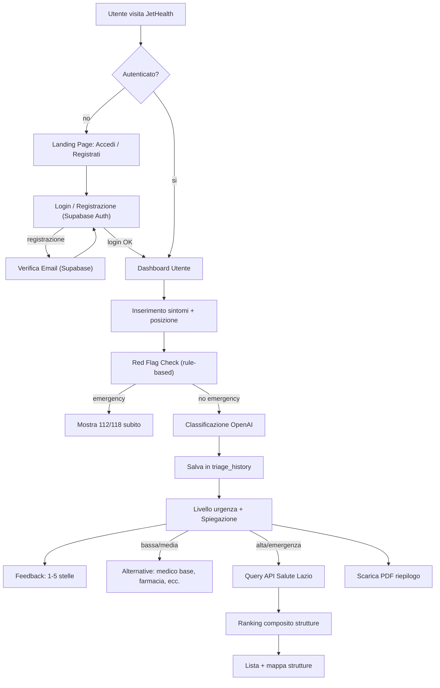

# JetHealth MVP Build Plan

## Tech Stack

- **Framework**: Next.js 15 (App Router) with TypeScript
- **UI**: shadcn/ui + Tailwind CSS v4
- **AI**: OpenAI (GPT-4o) -- chiave API in variabile d'ambiente Docker
- **Maps**: Leaflet + react-leaflet + OpenStreetMap tiles (gratuito, no API key)
- **Geocoding fallback**: Nominatim / OpenStreetMap (gratuito, no API key)
- **Backend/DB**: Supabase Cloud (PostgreSQL + Auth + Email)
- **PDF**: jsPDF (generazione client-side)
- **Deployment**: Docker (container Next.js, Supabase e' in cloud)
- **Validation**: Zod per input/output schemas

## Project Structure

```
jethealth/
  supabase/
    migrations/
      001_initial_schema.sql    # Tabelle: profiles, app_settings, triage_history, feedback, api_call_logs
  src/
    app/
      layout.tsx                # Root layout, fonts, metadata, Supabase provider
      page.tsx                  # Landing page pubblica
      auth/
        login/page.tsx          # Login utente
        register/page.tsx       # Registrazione con checkbox consenso dati
        forgot-password/page.tsx
        reset-password/page.tsx
        verify/page.tsx         # Callback verifica email
      (protected)/
        layout.tsx              # Auth guard (redirect a /auth/login se non autenticato)
        dashboard/page.tsx      # Home utente autenticato (CTA principali)
        triage/page.tsx         # Inserimento sintomi + domande guidate
        results/page.tsx        # Risultato triage + feedback + PDF
        facilities/
          page.tsx              # Mappa + lista strutture
          [id]/page.tsx         # Dettaglio struttura
        history/page.tsx        # Storico triage utente
        profile/page.tsx        # Profilo utente + cambio password + elimina account
      admin/
        layout.tsx              # Admin layout + auth guard (role: admin)
        dashboard/page.tsx      # Analytics aggregati
        settings/page.tsx       # Configurazione app
        users/page.tsx          # Gestione utenti
        api-monitor/page.tsx    # Log chiamate API
      api/
        setup/route.ts          # Bootstrap primo admin
        triage/route.ts         # POST /api/triage (auth required)
        facilities/route.ts     # GET /api/facilities (auth required)
        admin/
          settings/route.ts     # CRUD app settings (admin only)
          users/route.ts        # Gestione utenti (admin only)
          api-logs/route.ts     # Query log API (admin only)
    components/
      ui/                       # shadcn components
      symptom-input.tsx
      guided-questions.tsx
      red-flag-check.tsx
      urgency-badge.tsx
      facility-card.tsx
      facility-map.tsx
      disclaimer.tsx
      emergency-banner.tsx
      feedback-widget.tsx       # Rating 1-5 stelle + commento
      pdf-summary.tsx           # Generazione PDF con jsPDF
      admin/
        admin-sidebar.tsx
        settings-form.tsx
        users-table.tsx
        api-logs-table.tsx
        analytics-cards.tsx
    lib/
      supabase/
        client.ts               # Supabase browser client
        server.ts               # Supabase server client (per API routes e RSC)
        middleware.ts            # Supabase auth middleware helper
      triage-engine.ts          # Motore rule-based red flags
      openai-triage.ts          # Classificazione OpenAI
      triage-schema.ts          # Zod schemas triage I/O
      lazio-api.ts              # LazioHealthApiService adapter
      facility-ranking.ts       # Algoritmo ranking composito
      geolocation.ts            # Geolocalizzazione browser + fallback Nominatim
      settings.ts               # Legge AppSettings da Supabase (cache in-memory 60s)
      api-logger.ts             # Logga chiamate API su Supabase
    middleware.ts               # Next.js middleware (auth check + refresh token)
  Dockerfile
  docker-compose.yml
  .env.example
```

## Architecture Flow



## Database Schema (Supabase PostgreSQL)

### Tabella `profiles`
Estende `auth.users` di Supabase con dati aggiuntivi. Creata automaticamente via trigger on auth.users insert.

| Colonna | Tipo | Note |
|---------|------|------|
| id | uuid (PK, FK auth.users) | |
| name | text | |
| role | text (default 'user') | 'user' o 'admin' |
| consent_data_storage | boolean (default false) | Consenso salvataggio dati triage |
| created_at | timestamptz | |
| updated_at | timestamptz | |

### Tabella `app_settings`
Configurazione app gestita dall'admin.

| Colonna | Tipo | Note |
|---------|------|------|
| id | serial (PK) | |
| key | text (unique) | es. 'openai_model', 'disclaimer_text' |
| value | text | |
| category | text | 'ai', 'facilities', 'general' |
| description | text | |
| updated_at | timestamptz | |
| updated_by | uuid (FK profiles) | |

### Tabella `triage_history`
Storico triage per utente. Solo se consent_data_storage = true.

| Colonna | Tipo | Note |
|---------|------|------|
| id | uuid (PK) | |
| user_id | uuid (FK profiles) | |
| symptoms_input | jsonb | Sintomi inseriti (testo o risposte guidate) |
| triage_result | jsonb | Risultato completo (urgenza, spiegazione, red flags, next steps...) |
| recommended_facilities | jsonb (nullable) | Strutture suggerite |
| created_at | timestamptz | |

### Tabella `feedback`
Feedback utente post-triage.

| Colonna | Tipo | Note |
|---------|------|------|
| id | uuid (PK) | |
| triage_id | uuid (FK triage_history) | |
| user_id | uuid (FK profiles) | |
| rating | integer (1-5) | |
| comment | text (nullable) | |
| created_at | timestamptz | |

### Tabella `api_call_logs`
Log tecnici delle chiamate API esterne.

| Colonna | Tipo | Note |
|---------|------|------|
| id | uuid (PK) | |
| service | text | 'openai' o 'salute_lazio' |
| endpoint | text | |
| method | text | |
| status_code | integer | |
| response_time_ms | integer | |
| tokens_used | integer (nullable) | Solo per OpenAI |
| error_message | text (nullable) | |
| created_at | timestamptz | |

### Row Level Security (RLS)

- **profiles**: utente legge/modifica solo il proprio profilo. Admin legge tutti.
- **triage_history**: utente legge/cancella solo i propri. Admin legge tutti (per analytics aggregate).
- **feedback**: utente crea solo i propri. Admin legge tutti.
- **app_settings**: solo admin legge/scrive.
- **api_call_logs**: solo admin legge. Insert via service role key (server-side).

## Implementation Details

### 1. Landing Page (`/`) -- pubblica
- Hero con headline: "Capisci dove andare, prima di andare in pronto soccorso."
- Due CTA: "Accedi" e "Registrati" (portano a `/auth/login` e `/auth/register`)
- Breve spiegazione di cosa fa JetHealth
- Disclaimer medico nel footer
- Se utente gia' autenticato, redirect a `/(protected)/dashboard`

### 2. Autenticazione (Supabase Auth)

**Registrazione (`/auth/register`)**:
- Form: nome, email, password, conferma password
- Checkbox obbligatorio: "Acconsento al trattamento dei miei dati sanitari come descritto nell'informativa privacy" (imposta `consent_data_storage: true` nel profilo)
- Password: minimo 8 caratteri
- Supabase Auth invia automaticamente l'email di verifica
- Pagina "Controlla la tua email per verificare l'account"
- Trigger SQL crea automaticamente il record in `profiles`

**Login (`/auth/login`)**:
- Form: email + password
- Supabase Auth gestisce la verifica credenziali e il check email verificata
- Sessione gestita da Supabase (@supabase/ssr) con cookie refresh

**Recupero password (`/auth/forgot-password`)**:
- Supabase Auth gestisce l'invio email e il reset token
- Pagina `/auth/reset-password` per impostare la nuova password

**Middleware Next.js** (`middleware.ts`):
- Verifica il token Supabase su ogni richiesta
- Rotte pubbliche: `/`, `/auth/*`
- Rotte protette: `/(protected)/*` -- redirect a `/auth/login` se non autenticato
- Rotte admin: `/admin/*` -- redirect se non autenticato o role != 'admin'
- Refresh automatico del token se in scadenza

### 3. Bootstrap Admin (`/api/setup`)
- Endpoint POST che crea il primo utente admin
- Email: `admin@jethealth.it`, password: `admin`
- Imposta `role: 'admin'` nel profilo
- Funziona SOLO se non esiste nessun utente con role 'admin' nel sistema
- Ritorna errore se un admin esiste gia' (impedisce abusi)
- Nessun meccanismo di force password change (e' un account di test)

### 4. Symptom Intake (`/(protected)/triage`)
- Due modalita': campo libero testo OR stepper guidato
- Domande guidate: eta', durata sintomi, intensita' dolore (1-10), febbre, difficolta' respiratorie, dolore toracico, perdita di coscienza, trauma recente, gravidanza, patologie note, farmaci assunti, allergie note, peggioramento rapido, sintomi neurologici
- Red-flag check client-side (rule-based): se critico, mostra immediatamente banner emergenza 112/118 con pulsante `tel:112` e salta la chiamata API
- Se non emergenza, submit a POST `/api/triage`

### 5. Triage API (`/api/triage`)
- Verifica autenticazione Supabase
- Validazione input con Zod
- Red-flag detection rule-based (deterministica)
- Chiamata OpenAI con system prompt conservativo:
  - Mai formulare diagnosi
  - Linguaggio prudente ed empatico in italiano
  - Output JSON strutturato (urgencyLevel, recommendedAction, plainLanguageExplanation, redFlagsDetected, nextSteps, watchFor, facilitySearchRequired, specialtyNeeds, confidence, safetyDisclaimer)
  - Sempre includere safety disclaimer
- Se OpenAI non risponde: ritorna errore "Servizio temporaneamente non disponibile, riprova tra qualche minuto"
- Salva risultato in `triage_history` (se l'utente ha dato il consenso)
- Logga la chiamata in `api_call_logs` (solo metadati tecnici, no sintomi)
- Ritorna risultato strutturato al client

### 6. Results Page (`/(protected)/results`)
- Mostra livello urgenza con badge colorato (verde/giallo/arancio/rosso)
- Spiegazione in linguaggio naturale in italiano
- Azione raccomandata + prossimi passi
- Sezione "Cosa monitorare"
- Alternative al PS per urgenza bassa/media
- Pulsante "Chiama 112/118" prominente (`tel:112`) per alta/emergenza
- Pulsante "Trova struttura vicina"
- Pulsante "Scarica PDF riepilogo" (jsPDF, client-side)
- Widget feedback: 1-5 stelle + commento opzionale. Salvato in tabella `feedback`

### 7. Facilities API + Map (`/api/facilities` e `/(protected)/facilities`)
- `LazioHealthApiService` adapter in `lazio-api.ts`:
  - Chiama `https://server.salutelazio.it/server/external-services/facilities/structures/list`
  - Parametri: coordinate utente, raggio, tipo struttura
  - Normalizza la risposta (nome, indirizzo, telefono, coordinate, distanza, tipo, tempi attesa, pazienti in attesa)
  - Gestione errori con messaggi fallback
  - Logga la chiamata in `api_call_logs`
- Facility ranking in `facility-ranking.ts`:
  - Punteggio composito: distanza, tempi attesa, numero pazienti, match specializzazione (cardiologia, neurologia, pediatria, maternita', trauma center)
- Mappa Leaflet con marker colorati + lista card ordinata
- Ogni card: nome, distanza, attesa stimata, pazienti in attesa, "Apri navigazione" (link a Google Maps / Apple Maps)

### 8. Geolocalizzazione
- Richiede permesso browser (`navigator.geolocation`)
- Se l'utente nega: mostra campo indirizzo manuale
- Geocodifica indirizzo via Nominatim (OpenStreetMap): `https://nominatim.openstreetmap.org/search`
- Rispettare il rate limit Nominatim (1 req/sec, User-Agent obbligatorio)

### 9. Facility Detail (`/(protected)/facilities/[id]`)
- Info complete: nome, indirizzo, telefono, orari, tipologia, tempi stimati
- Link navigazione (apre Google Maps / Apple Maps)
- Banner emergenza: "In emergenza chiama 112/118"

### 10. Storico Triage (`/(protected)/history`)
- Lista dei triage passati dell'utente (data, livello urgenza, azione raccomandata)
- Click per vedere il dettaglio completo (sintomi, spiegazione, strutture suggerite)
- Visibile solo se l'utente ha dato il consenso al salvataggio dati

### 11. Profilo Utente (`/(protected)/profile`)
- Visualizza e modifica nome, email
- Cambio password
- **Elimina account**: dialog di conferma, cancella il profilo + triage_history + feedback associati, poi elimina l'utente da Supabase Auth

### 12. PDF Riepilogo Medico
- Generato client-side con jsPDF
- Contenuto: sintomi, durata, intensita', fattori di rischio, raccomandazione JetHealth, timestamp, disclaimer
- Branding JetHealth (logo, colori)
- L'utente lo scarica e lo invia al medico come preferisce

### 13. Admin Panel

**Layout** (`/admin/layout.tsx`):
- Sidebar con navigazione: Dashboard, Impostazioni, Utenti, Monitor API
- Auth guard: verifica che l'utente abbia `role: 'admin'` nel profilo
- Se non admin, redirect a `/(protected)/dashboard`
- Bottone logout

**Dashboard** (`/admin/dashboard`):
- Card riassuntive: triage totali (oggi/settimana/mese), distribuzione per urgenza, % reindirizzati fuori dal PS, feedback medio
- Grafici (recharts): trend triage nel tempo, distribuzione urgenza, andamento feedback
- Dati aggregati e anonimizzati (no dati personali)

**Settings** (`/admin/settings`):
- **Configurazione AI**: modello OpenAI (dropdown), max tokens, system prompt personalizzato (textarea)
- **Configurazione strutture**: URL base API Salute Lazio, raggio ricerca default (km)
- **Generale**: testo disclaimer personalizzabile
- Valori salvati in tabella `app_settings` su Supabase
- Cache in-memory 60s nel server Next.js (le modifiche prendono effetto rapidamente senza restart)

**Gestione Utenti** (`/admin/users`):
- Tabella utenti registrati: nome, email, email verificata, ruolo, stato attivo, data registrazione
- **Disabilita/Riabilita**: l'utente disabilitato non puo' fare login (ban via Supabase Auth Admin API)
- **Elimina account**: cancella utente + tutti i dati associati (profilo, storico triage, feedback)
- **Promuovi/Declassa**: cambia ruolo user/admin

**Monitor API** (`/admin/api-monitor`):
- Card riassuntive: chiamate totali oggi, success rate, tempo medio risposta, token OpenAI usati oggi
- Tabella filtrabile: servizio, endpoint, status code, tempo risposta, token, errore, timestamp
- Filtri: range date, tipo servizio (OpenAI/Salute Lazio), stato (success/error)
- Auto-cleanup: log piu' vecchi di 30 giorni vengono eliminati (configurabile)
- Nessun dato sintomo nei log -- solo metadati tecnici

### 14. Safety and Compliance
- Account obbligatorio per usare l'app
- Consenso esplicito al salvataggio dati sanitari durante la registrazione
- Eliminazione account cancella tutti i dati associati (GDPR diritto alla cancellazione)
- Password hashate da Supabase Auth (bcrypt)
- Dati sanitari in Supabase Cloud (PostgreSQL con RLS)
- API call logs contengono solo metadati tecnici, mai dati sintomo
- Disclaimer medico visibile su ogni pagina
- Triage conservativo: nel dubbio, escalare
- `.env` per segreti: `OPENAI_API_KEY`, `NEXT_PUBLIC_SUPABASE_URL`, `NEXT_PUBLIC_SUPABASE_ANON_KEY`, `SUPABASE_SERVICE_ROLE_KEY`

### 15. Docker Deployment
- Multi-stage `Dockerfile`: build stage (Node 22 + npm) + production stage (Node 22 slim)
- `docker-compose.yml` con variabili d'ambiente
- `.env.example` con tutte le variabili necessarie documentate
- Il DB e' su Supabase Cloud, il container Docker contiene solo l'app Next.js
- Le migrazioni SQL si eseguono dalla CLI Supabase o dalla dashboard

## Key Design Decisions

- **Supabase Cloud come backend**: PostgreSQL per i dati, Auth per l'autenticazione (registrazione, login, verifica email, reset password), email transazionali gestite da Supabase. Niente SQLite, niente NextAuth, niente Prisma. Deploy semplificato.
- **Hybrid triage**: il motore rule-based rileva le emergenze in modo deterministico e istantaneo. OpenAI gestisce la classificazione fine e genera la spiegazione in linguaggio naturale. Se OpenAI non risponde, l'app mostra un errore (le emergenze sono gia' state catturate dal rule-based prima della chiamata).
- **Consenso esplicito**: i dati triage vengono salvati solo se l'utente ha dato il consenso durante la registrazione. Eliminazione account cancella tutto.
- **Ruoli in Supabase**: utenti e admin nella stessa Auth, distinti dal campo `role` in `profiles`. RLS controlla l'accesso ai dati.
- **Italian-only per MVP**: tutta la UI e le risposte AI in italiano. Multilingua rimandato.
- **Nessun rate limiting per MVP**: da aggiungere successivamente.
- **Nessun test per MVP**: test manuali, test automatizzati da aggiungere dopo.

## Environment Variables (.env.example)

```
# Supabase
NEXT_PUBLIC_SUPABASE_URL=https://xxxxx.supabase.co
NEXT_PUBLIC_SUPABASE_ANON_KEY=eyJ...
SUPABASE_SERVICE_ROLE_KEY=eyJ...

# OpenAI
OPENAI_API_KEY=sk-...
```
